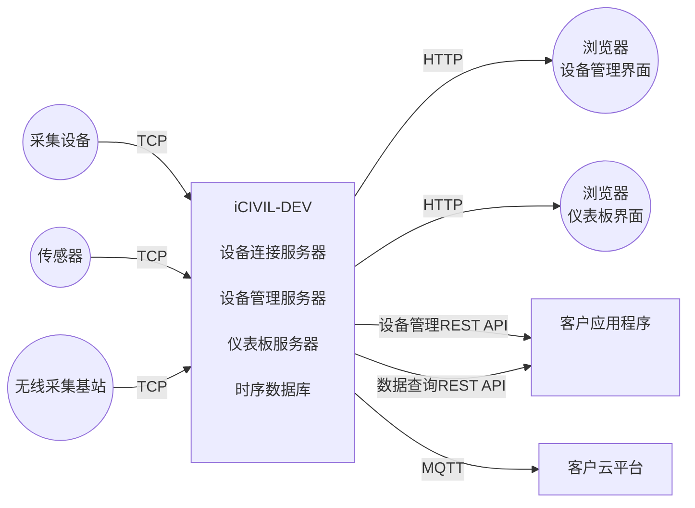

# iCIVIL-DEV用户手册

## 简介

iCIVIL-DEV是设备连接与管理服务器。它通过TCP协议连接传感器和数据采集设备，解析、存储上行消息，结构化存储测量数据，缓存、下发控制指令和配置信息。它为应用层软件提供了设备实体及测量数据的抽象描述。应用层软件可以通过HTTP REST API访问iCIVIL-DEV,进行设备管理，数据查询，也可以通过MQTT接口和iCIVIL-DEV进行通讯，订阅上行数据，下发下行指令。

iCIVIL-DEV提供后台管理界面，用户可以登录到iCIVIL-DEV的后台查看和管理设备，用户和日志消息。和iCIVIL-DEV连接的设备会自动建立关于自己的描述信息，包括设备ID，配置信息，标签属性，所包含的传感器，及其类型和通道等属性。用户可以通过管理界面下发控制指令和配置信息给指定设备。如果设备暂时没有和iCIVIL-DEV连接，该指令会被缓存，等到该设备下次连接时，指令会自动下发。

iCIVIL-DEV提供仪表板界面。用户可以登录到iCIVIL-DEV的仪表板界面查看传感器数据图表，包括最近值，历史曲线和数据查询等功能。

用户通过一组REST API来进行可以通过后台管理界面进行的所有操作，所有的内容都以JSON字符串的形式表示。

传感器上行的测量数据会被存储到InfluxDB时序数据库中。InfluxDB提供一组REST API以及类SQL的查询语句，可以很方便的对时序数据库中的数据进行查询等操作。

## 安装

## 准备设备

## 管理设备

## 查看数据

## 通过REST API访问

## MQTT接口

## 设备管理REST API参考

## 数据查询REST API

## 数据查询SDK

<!--stackedit_data:
eyJoaXN0b3J5IjpbLTIwNDc5NjY1NzZdfQ==
-->