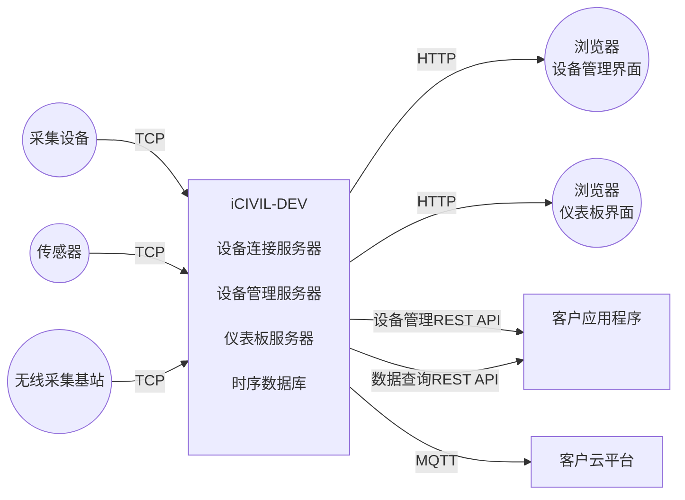

# iCIVIL-DEV REST API示例

## 简介



iCIVIL-DEV是设备连接与管理服务器。它通过TCP协议连接传感器和数据采集设备，解析、存储上行消息，结构化存储测量数据，缓存、下发控制指令和配置信息。它为应用层软件提供了设备实体及测量数据的抽象描述。应用层软件可以通过HTTP REST API访问iCIVIL-DEV,进行设备管理，数据查询，也可以通过MQTT接口和iCIVIL-DEV进行通讯，订阅上行数据，下发下行指令。

iCIVIL-DEV提供后台管理界面，用户可以登录到iCIVIL-DEV的后台查看和管理设备，用户和日志消息。和iCIVIL-DEV连接的设备会自动建立关于自己的描述信息，包括设备ID，配置信息，标签属性，所包含的传感器，及其类型和通道等属性。用户可以通过管理界面下发控制指令和配置信息给指定设备。如果设备暂时没有和iCIVIL-DEV连接，该指令会被缓存，等到该设备下次连接时，指令会自动下发。

iCIVIL-DEV提供仪表板界面。用户可以登录到iCIVIL-DEV的仪表板界面查看传感器数据图表，包括最近值，历史曲线和数据查询等功能。

用户通过一组REST API来进行可以通过后台管理界面进行的所有操作，所有的内容都以JSON字符串的形式表示。

传感器上行的测量数据会被存储到InfluxDB时序数据库中。InfluxDB提供一组REST API以及类SQL的查询语句，可以很方便的对时序数据库中的数据进行查询等操作。

## 准备
* 主机
将iCIVIL-DEV安装在本地计算机，主机为: http://localhost:5001

*  登录
REST API访问目前无需登录。
后台管理界面登录以及仪表板应用登录用户名/密码为：root/root

* 工具
可以通过任何编程语言提供的REST库进行访问，也可以通过浏览器查看, 推荐使用[HTTPie](https://httpie.org/)进行调试。

## 通过REST API访问

### 特殊类型说明

特殊类型以$开始

* "$uri"
代表资源的uri

* "$ref"
代表关联资源的uri

### 查询设备信息

* GET /api/device
获取设备列表
返回：

```
[
    {
        "$uri": "/api/device/1", 
        "addr": "00001000", 
        "cfg_json": "{}", 
        "device_commands": [], 
        "name": "null", 
        "owner_email": null, 
        "sensors": [
            {
                "$ref": "/api/sensor/1"
            }, 
            {
                "$ref": "/api/sensor/2"
            }, 
            {
                "$ref": "/api/sensor/3"
            }, 
            {
                "$ref": "/api/sensor/4"
            }, 
            {
                "$ref": "/api/sensor/5"
            }
        ], 
        "spec_type": null, 
        "tag_json": "{}", 
        "user_emails": null
    },
    ... 
    ]

```
* GET /api/device/1
获取id=1的设备信息
返回:
```
{
    "$uri": "/api/device/1", 
    "addr": "00001000", 
    "cfg_json": "{}", 
    "device_commands": [], 
    "name": "null", 
    "owner_email": null, 
    "sensors": [
        {
            "$ref": "/api/sensor/1"
        }, 
        {
            "$ref": "/api/sensor/2"
        }, 
        {
            "$ref": "/api/sensor/3"
        }, 
        {
            "$ref": "/api/sensor/4"
        }, 
        {
            "$ref": "/api/sensor/5"
        }
    ], 
    "spec_type": null, 
    "tag_json": "{}", 
    "user_emails": null
}

```
* GET  /api/device/1/cfg-json
获取id=1的设备的配置信息
返回:
```
"{}"
```


### 配置设备

### 查询数据

* InfluxDB连接设置

用户名/密码：root/root
数据库名称: device_sensor
数据表名称: device_sensor_data

* 使用influx CLI命令行访问


<!--stackedit_data:
eyJoaXN0b3J5IjpbOTE4MDU2OTUxXX0=
-->